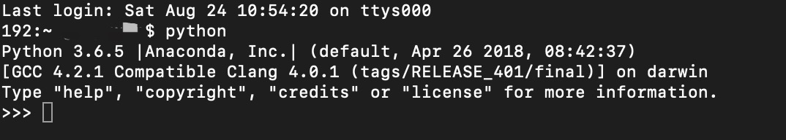
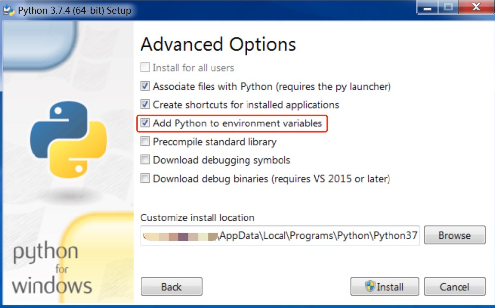

# 环境配置

**语言环境**：由于 Sphinx 是基于 Python 开发的框架工具，安装和使用 Sphinx 环境需要先配置好 Python 环境，然后通过 Python 安装工具 pip 安装 Sphinx。

#### 检查 Python 环境

-  **MacOS 系统**  
Mac系统一般自带 Python，打开`终端`，输入`python`并按回车键，会进入终端的 Python 临时运行环境，并显示 Python 版本信息。如下图，要退出当前状态，输入`quit()`即可。

- **Windows 系统**  
如果之前未安装过 Python 或其他集成了 Python 的编程环境，一般是没有 Python 环境的，需要安装。  
检查的方法与 MaxOS 系统类似，通过`开始`搜索功能，搜索并打开`cmd`，输入`python`后按回车键，如果已安装，则进入 Python 环境，如果没有，则提示命令错误信息。

#### 安装 Python

- **从 Anaconda 安装**  
Annaconda 是一个开源的 python 包资源管理器，通过 Anaconda 配置 Python 环境可以不通过命令行安装 Sphinx。  
在 <a href="https://www.anaconda.com/distribution/#download-section" target="_blank">Anaconda 官网</a>下载适合电脑系统的版本，注意选择 python3.7版本的 Anaconda。

- **从 Python 官网安装**  
从<a href="https://www.python.org/downloads/release/python-374/" target="_blank"> Python 官网</a>选择合适的 Python 3.X.X 版本进行下载安装，从官网下载安装包速度较慢是正常现象。   
**注意：** 如下图，Windows 安装 Python 时需要勾选**将 Python 到搭配环境变量**选项。

#### Python 安装问题
- 如何将 Python 路径添加到环境变量
- MacOS 系统如何彻底删除 Python2 版本