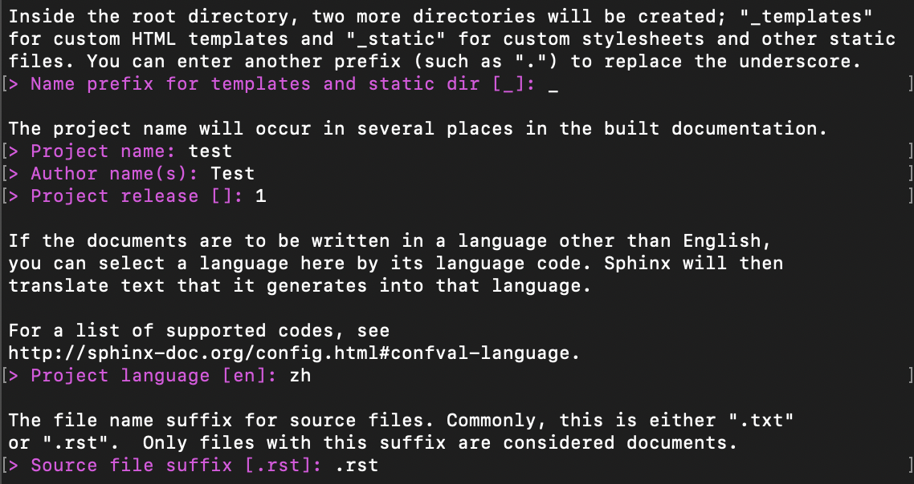
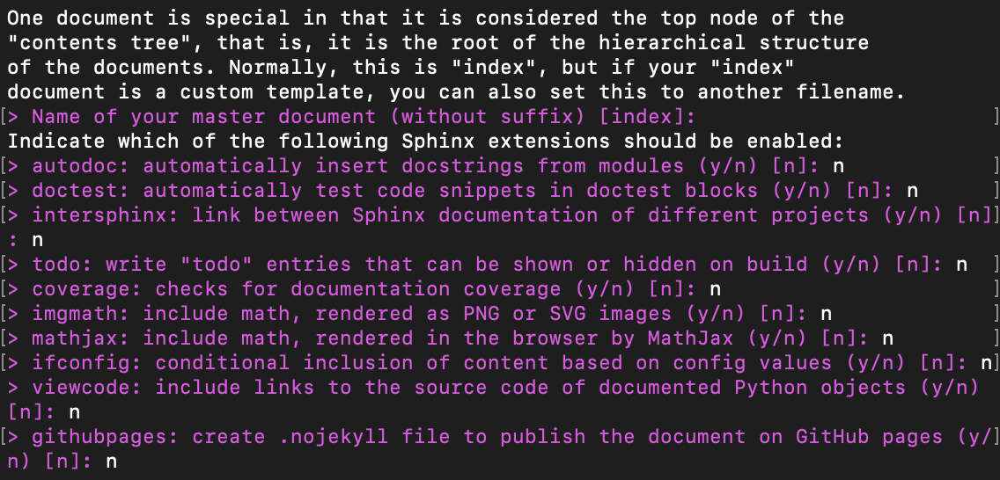

# 通过 sphinx-quickstart 新建项目

#### 新建项目

打开命令行工具，输入```sphinx-quickstart```新建一个 Sphinx 项目。  

本演示所用的 Sphinx 是 1.8.1 版本，更高版本的 Sphinx 在这个过程中可能有些许不同，老版本的新建项目选项可能比新版本稍多。

1. 选定新建 Sphinx 项目的目标路径，新建一个项目文件夹，并将该文件夹拖进命令行工具窗口。这样做能够更便捷在命令行工具中到达指定路径。

2. 输入```sphinx-quickstart```开始新建 Sphinx 项目。

3. 选择是否要将<u>项目资源</u>与<u>项目构建文件</u>分开，建议选择“是”。项目元素将在下一章进行详细介绍。


4. 设置静态文件的前缀名`_`，项目名称，作者，项目发布版本，项目语言，资源文件后缀。资源文件后缀默认是`.rst`，即 reStructuredText 。若采用 Markdown 进行文档写作，可在配置文件`conf.py`中进行更改，具体配置在`项目元素`章节。


5. 其他功能配置，按照提示输入`[]`中的内容即可，默认是不开启，需要时可选择开启。


**注意**：`sphinx-quickstart` 过程中进行的配置在创建项目之后都可以进行修改，若有步骤未操作正确可稍后修正。

#### 添加文档内容

